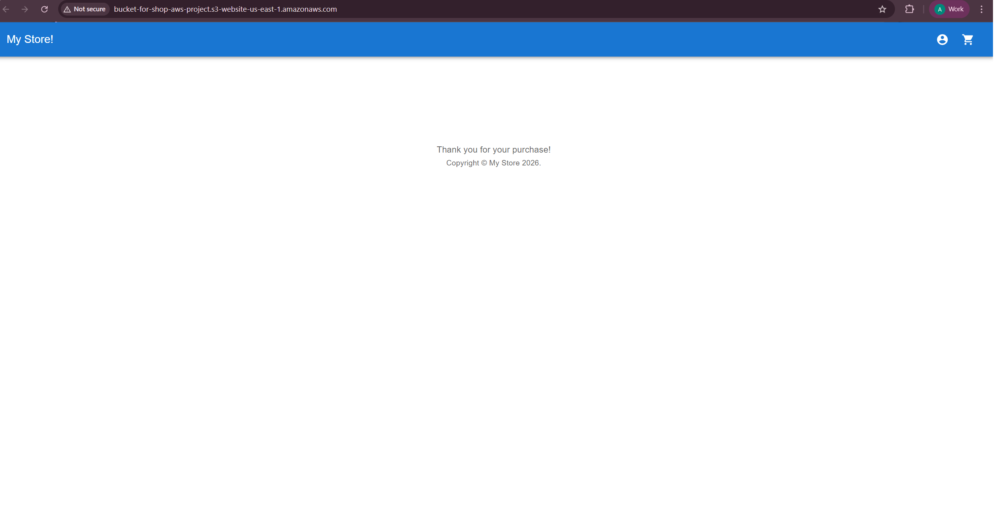
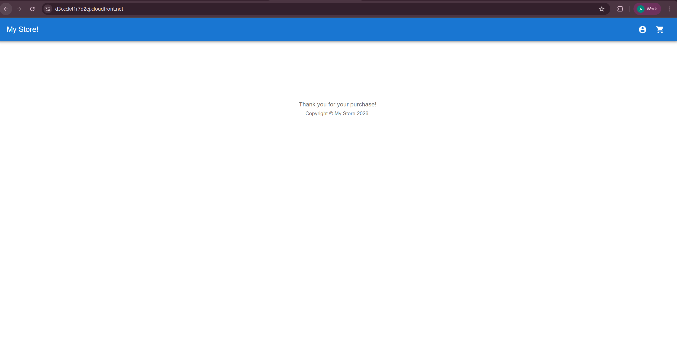
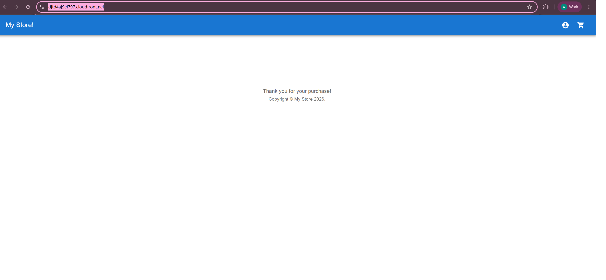
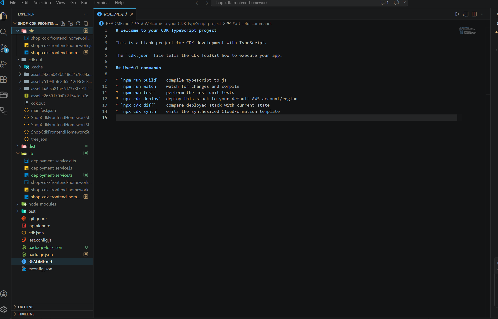

# React-shop-cloudfront

## What was done?

- In the AWS Console create and configure an S3 bucket where you will host your app (follow instructions in training materials).
- Build and manually upload the MyShop! app to the created S3 bucket. Check if the app is available through the Internet: [http://bucket-for-shop-aws-project.s3-website-us-east-1.amazonaws.com](http://bucket-for-shop-aws-project.s3-website-us-east-1.amazonaws.com/)

- Create a CloudFront distribution for your app as it was described in training materials. Check your S3 bucket policy changes. Check if the app is available through the Internet over given CloudFront URL: [https://d3ccck41r7d2ej.cloudfront.net/](https://d3ccck41r7d2ej.cloudfront.net/)

- Add and configure the necessary AWS CDK constructs as per requirements. Create necessary npm scripts to build your application, upload it to your S3 bucket, and invalidate the CloudFront cache from your local machine in an automated manner. Check if everything operates smoothly and all updates are reflected on your website: [https://djtd4aj9el797.cloudfront.net/](https://djtd4aj9el797.cloudfront.net/)

- Codebase for the CDK/automated deployment is in my local because I initialized a new CDK project for that and moved the dist folder from npm run build into it:

This is frontend starter project for nodejs-aws mentoring program. It uses the following technologies:

- [Vite](https://vitejs.dev/) as a project bundler
- [React](https://beta.reactjs.org/) as a frontend framework
- [React-router-dom](https://reactrouterdotcom.fly.dev/) as a routing library
- [MUI](https://mui.com/) as a UI framework
- [React-query](https://react-query-v3.tanstack.com/) as a data fetching library
- [Formik](https://formik.org/) as a form library
- [Yup](https://github.com/jquense/yup) as a validation schema
- [Serverless](https://serverless.com/) as a serverless framework
- [Vitest](https://vitest.dev/) as a test runner
- [MSW](https://mswjs.io/) as an API mocking library
- [Eslint](https://eslint.org/) as a code linting tool
- [Prettier](https://prettier.io/) as a code formatting tool
- [TypeScript](https://www.typescriptlang.org/) as a type checking tool

## Available Scripts

### `start`

Starts the project in dev mode with mocked API on local environment.

### `build`

Builds the project for production in `dist` folder.

### `preview`

Starts the project in production mode on local environment.

### `test`, `test:ui`, `test:coverage`

Runs tests in console, in browser or with coverage.

### `lint`, `prettier`

Runs linting and formatting for all files in `src` folder.

### `client:deploy`, `client:deploy:nc`

Deploy the project build from `dist` folder to configured in `serverless.yml` AWS S3 bucket with or without confirmation.

### `client:build:deploy`, `client:build:deploy:nc`

Combination of `build` and `client:deploy` commands with or without confirmation.

### `cloudfront:setup`

Deploy configured in `serverless.yml` stack via CloudFormation.

### `cloudfront:domainInfo`

Display cloudfront domain information in console.

### `cloudfront:invalidateCache`

Invalidate cloudfront cache.

### `cloudfront:build:deploy`, `cloudfront:build:deploy:nc`

Combination of `client:build:deploy` and `cloudfront:invalidateCache` commands with or without confirmation.

### `cloudfront:update:build:deploy`, `cloudfront:update:build:deploy:nc`

Combination of `cloudfront:setup` and `cloudfront:build:deploy` commands with or without confirmation.

### `serverless:remove`

Remove an entire stack configured in `serverless.yml` via CloudFormation.
